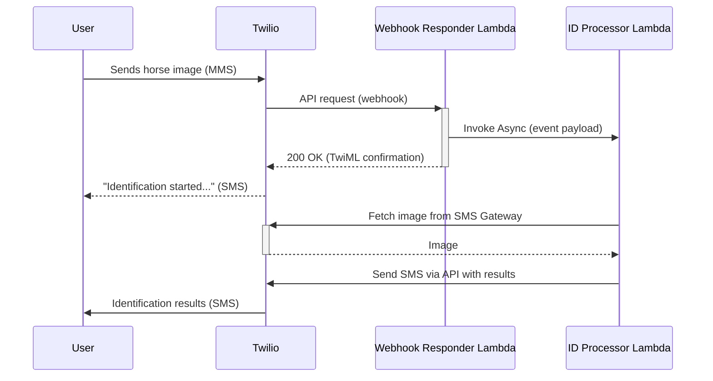
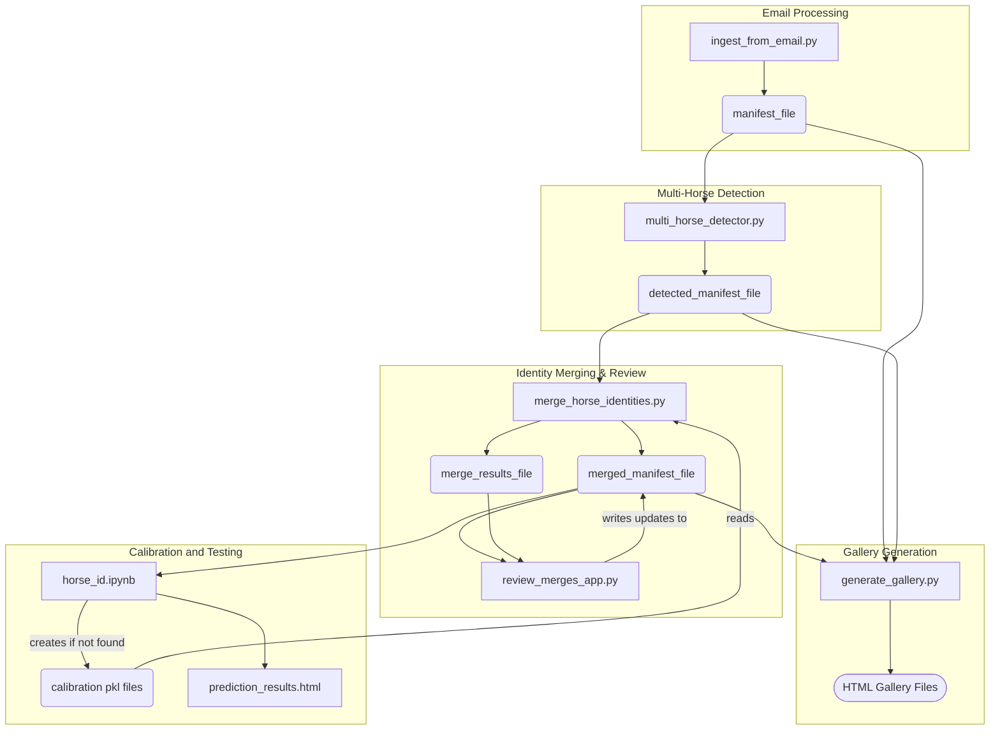

# Horse Identity Matching System

This system is designed to identify an individual horse based on its picture, using a database of labeled horse images that are collected from emails that contain these images as attachments. The system contains components which processes emails containing horse photos, detects horses in those photos, merges photos of the same horse from different emails into a single identity, tools to review images and correct merges, and to extract features.

SMS/MMS (via Twilio SMS Gateway) is the interface used for individual horse identification.  The user sends a MMS message containing a photo of a horse, and they get an SMS response containing the horse's identity.

## System Overview

The workflow is divided into several stages, each handled by a specific Python script:

1.  **Email Ingestion (`ingest_from_email.py`)**: Fetches emails from a Gmail account, extracts horse names from subjects, saves image attachments, and creates an initial manifest of photos.
2.  **Multi-Horse Detection (`multi_horse_detector.py`)**: Analyzes each downloaded image to detect the number of horses present (NONE, SINGLE, MULTIPLE) using a YOLOv5 model. It updates the manifest with this detection information.
3.  **Identity Merging (`merge_horse_identities.py`)**: Compares images of horses (identified as 'SINGLE' detection) with the same extracted horse name but from different emails. It uses the WildFusion similarity system to determine if they are the same horse and merges their identities by assigning a common `canonical_id`.
4.  **Merge Review (`review_merges_app.py`)**: A web application that allows a user to review the automated merge decisions from `merge_horse_identities.py`, manually merge or un-merge identities, and correct any errors.
5.  **Gallery Generation (`generate_gallery.py`)**: Creates interactive HTML galleries from the various manifest CSV files (base, detected, and merged), allowing for easy visual inspection and filtering of the image data at different stages of processing.
6. **Calibration and Testing (`horse_id.ipynb`)**: Creates calibration files if none exist, evaluates model performance and creates the prediction results file for side-by-side comparison of test images and model predictions.
7. **Feature Extraction (`extract_features.py`)**: Extracts features using [Wildlife-mega-L-384](https://huggingface.co/BVRA/MegaDescriptor-L-384).
8. **Upload data (`upload_to_s3.py`)**: Uploads manifest and extracted features to s3.
9. **AWS Lambda Function: (`horse_id.py`)**: Performs similarity comparison between the query image using pre-extracted features.


### Key Technologies and Frameworks

*   **WildlifeTools Framework**: This system heavily relies on the [WildLife Tools](https://wildlifedatasets.github.io/wildlife-tools/) and [WildLife Datasets](https://wildlifedatasets.github.io/wildlife-datasets/) tools designed for individual animal identification. Key components from WildlifeTools used include:
    *   `ImageDataset` for loading and managing image data.
    *   Feature extractors like `DeepFeatures` (utilizing [Wildlife-mega-L-384](https://huggingface.co/BVRA/MegaDescriptor-L-384), and `SuperPointExtractor`.
    *   Similarity matching framework
    *   The `WildFusion` pipeline for calibrating and combining multiple similarity scores.
*   **YOLOv5**: Used by `multi_horse_detector.py` for multi-object detection, specifically to identify images that contain multiple horses.
*   **Streamlit**: (https://streamlit.io/) Framework used by `review_merges_app.py` to create an interactive web application for merge review.

## 🧪 Testing

This project includes a comprehensive unit test suite with **146 tests covering all critical functionality**.

### Quick Start Testing
```bash
# Complete test suite with coverage (recommended)
./run_tests.sh

# Fast development feedback
./run_tests_quick.sh

# Core functionality validation
./run_tests_optimal.sh
```

### Test Results
- **Status**: ✅ All 146 tests passing (100% success rate)
- **Coverage**: 62% overall, 100% for critical webhook processing
- **Coverage Report**: `test-results/coverage-html/index.html`

### Test Documentation
- **Testing Guide**: `README_TESTING.md`
- **Coverage Analysis**: `view_coverage.md`
- **Final Status**: `TESTS_FINAL_STATUS.md`

The test suite validates:
- ✅ Twilio webhook processing and validation
- ✅ Horse detection algorithms and bounding box calculations
- ✅ Image processing and data filtering logic
- ✅ Configuration loading and validation
- ✅ Email parsing and horse name extraction
- ✅ S3 operations and error handling
*   **Google Gmail API**: Used by `ingest_from_email.py` to fetch and process emails.

## Core Scripts and Functionality

### 1. Email Ingestion (`ingest_from_email.py`)

*   **Authentication**: Securely connects to a specified Gmail account using OAuth 2.0. Credentials and tokens are managed via `credentials.json` and `token.json` (generated on first run).
*   **Email Fetching**: Retrieves new emails that haven't been processed yet by comparing message IDs against the existing manifest.
*   **Information Extraction**:
    *   **Horse Name**: Extracts the horse's name from the email subject line using regular expressions (e.g., "HorseName - Season Year").
    *   **Email Date**: Determines the oldest relevant date associated with the email content, considering forwarded message headers and the email's internal date. The date is included as part of the image metadata.
*   **Attachment Handling**:
    *   Identifies and downloads image attachments (JPG, JPEG, PNG, GIF).
    *   Assigns a unique `canonical_id` to all photos from the *same email*. 
    *   Saves images to a configured `dataset_dir` with a filename format: `{message_id}-{original_filename}`. If duplicate original filenames exist within the same email, a counter is appended (e.g., `{message_id}-{base}-{count}{ext}`).
*   **Manifest Creation**: Creates or updates a CSV file (specified by `manifest_file` in `config.yml`) with one row per downloaded image.

### 2. Multi-Horse Detection (`multi_horse_detector.py`)

*   **Purpose**: Many photos collected by `ingest_from_email.py` contain images of multiple horses. The goal of `multi-horse_detector.py` is to select the photos which are unambiguously images of the labeled horse. These images are labeled SINGLE.  Images which are labeled MULTIPLE and NONE are ignored in subsequent processing.
*   **Model Loading**: Loads a pre-trained YOLOv5 model specified in `config.yml`.
*   **Image Analysis**: For each image in the manifest (from the output of `ingest_from_email.py`):
    *   Detects objects and identifies horses (COCO class 17).
    *   **Classification**:
        *   `NONE`: No horses detected.
        *   `SINGLE`: One horse detected, or multiple horses where one is significantly larger than others (based on `SIZE_RATIO` in `config.yml`).
        *   `MULTIPLE`: Multiple horses detected where no single horse is dominant enough to be considered 'SINGLE'.
    *   **Size Ratio**: If multiple horses are detected, it calculates the ratio of the largest horse's bounding box area to the next largest. This is stored as `size_ratio`.
*   **Manifest Update**: Reads the manifest from the previous step, adds/updates `num_horses_detected` and `size_ratio` columns, and saves it to a new CSV file (`detected_manifest_file` in `config.yml`). The system preserves previous detection results if the output file already exists.

### 3. Identity Merging (`merge_horse_identities.py`)

*   **Purpose**: There are multiple emails available for each horse, each with images taken at different times. There are also multiple horses with the same name. The purpose of `merge_horse_identities.py` is to determine whether horses with the same name but different canonical_id are actually the same horse.
*   **Similarity System**: Leverages the **WildlifeTools framework** (specifically WildFusion) to perform image similarity comparisons. It employs a combination of deep learning features (e.g., from `BVRA/wildlife-mega-L-384`) and local feature matchers (e.g., SuperPoint with LightGlue). Calibrated models are expected to be present in the `calibration_dir`.
*   **Candidate Selection**:
    *   Filters the manifest for images marked as `SINGLE` horse detections.
    *   Groups these images by the `horse_name` extracted from email subjects.
*   **Pairwise Comparison**:
    *   Within each `horse_name` group, it compares sets of images belonging to different `message_id`s.
    *   The `check_similarity` function uses WildFusion to compute a similarity score between image sets from two different messages. A match is determined if the score exceeds `SIMILARITY_THRESHOLD` from `config.yml`.
*   **Graph-Based Merging**:
    *   Builds a graph where nodes are `canonical_id`s (initially, one per email).
    *   An edge is added between two `canonical_id`s if their respective image sets (from different messages) are deemed similar.
    *   Finds connected components in this graph. All `canonical_id`s within a component are considered to represent the same horse.
    *   The lowest `canonical_id` in a component becomes the new `canonical_id` for all images belonging to that component.
*   **Manifest Update**: Updates the `canonical_id` and `last_merged_timestamp` in the manifest (read from `detected_manifest_file`) and saves it to `merged_manifest_file`.
*   **Merge Log**: Records each pairwise comparison (whether a match or not) along with similarity scores and relevant IDs into `merge_results_file`. This log facilitates merge review and is used to avoid recomparisons.

### 4. Merge Review (`review_merges_app.py`)

*   **Purpose**: This tool is used for analyzing and correcting the results of `merge_horse_identities.py`.
*   **Web Interface**: A Streamlit application for interactively reviewing and correcting merge decisions.
*   **Data Loading**: Loads the `merged_manifest_file` (current state of identities) and `merge_results_file` (log of comparisons).
*   **Review Process**:
    *   Iterates through pairs of `message_id`s as recorded in `merge_results_file`.
    *   For each pair, it displays:
        *   Images from both messages.
        *   Their current `canonical_id` and original `canonical_id` (from the manifest).
        *   The similarity score and the system's predicted match status (from `merge_results_file`).
        *   Whether they are currently merged in the manifest.
*   **User Actions**:
    *   **Merge**: If two identities are deemed the same by the user, they can be merged. The app updates the `canonical_id` of all images associated with one identity to match the other (choosing the lower ID as the target). `last_merged_timestamp` is updated.
    *   **Un-merge**: If a previous merge (either by system or user) is incorrect, the identities can be separated. The app reverts the `canonical_id` of the images in the selected messages back to their `original_canonical_id`. `last_merged_timestamp` is cleared.
    *   **Skip**: No change is made.
*   **Manifest Saving**: Any changes made by the user are saved back to the `merged_manifest_file`.

### 5. Gallery Generation (`generate_gallery.py`)

*   **Purpose**: Generate static HTML web galeries for easy review of each of the manifest files.
*   **Multi-Manifest Support**: Reads the base manifest (`manifest_file`), the detected manifest (`detected_manifest_file`), and the final merged manifest (`merged_manifest_file`).
*   **HTML Gallery Creation**: For each manifest, it generates a self-contained static HTML file (e.g., `horse_gallery_base.html`, `horse_gallery_detected.html`, `horse_gallery_merged.html`).
*   **Interactive Features**:
    *   **Navigation**: Allows users to switch between gallery views for the different manifest stages.
    *   **Filtering**: Provides dropdowns and checkboxes to filter images by:
        *   Horse Name
        *   Detection Status (SINGLE, MULTIPLE, NONE)
        *   Merged Status (for the merged gallery, showing horses whose `canonical_id` differs from `original_canonical_id`)
        *   Unmerged (Multiple IDs) Status (showing horses that have multiple `canonical_id`s under the same name)
        *   Size ratio of the bounding box of the largest horse in the image to the next largest horse in the image. 
    *   **Image Modal**: Clicking on an image opens a larger view with detailed metadata (horse name, IDs, detection status, filename, email date, size ratio).
*   **Output**: Saves the generated HTML files to `data_root` directory, specified in `config.yml`.

### 6. Calibration and Testing Notebook (`horse_id.ipynb`)
*   **Purpose**: This Jupyter notebook is used for two primary functions:
    1.  **Calibration**: To train and calibrate the individual similarity matchers (e.g., `MatchLightGlue` with `SuperPointExtractor`) used within the `WildFusion` system. This process generates `.pkl` files containing `IsotonicCalibration` models, which are saved to the `calibration_dir`.
    2.  **Testing**: To evaluate the performance of the configured `WildFusion` system on test set of horse images that is exclusive from the images used for calibration.
*   **Workflow**:
    *   **Data Loading**:
        *   Loads the `merged_manifest_file`. 
        *   Creates a `WildlifeDataset` (custom `Horses` class) from the manifest, filtering for 'SINGLE' detected horses.
    *   **Data Splitting**: Uses `wildlife_datasets.splits` to divide the dataset into calibration and testing sets, and further splits the testng set into query and database sets.
    *   **Calibration Fitting/Loading**:
        *   Checks for existing `.pkl` calibration files in `CALIBRATION_DIR`.
        *   If files exist, they are loaded.
        *   If not, `wildfusion.fit_calibration()` is called on the training dataset to train the calibrators, which are then saved as `.pkl` files.
    *   **WildFusion System**: Initializes the `WildFusion` system with the (now calibrated) pipelines and a priority pipeline (e.g., `DeepFeatures`).
    *   **Similarity Computation**: Computes a similarity matrix between the query and database image sets using the `WildFusion` system.
    *   **Evaluation**: Uses a `KnnClassifier` to predict identities for the query set based on the similarity matrix and calculates the accuracy of the predictions.
    *   **Visualization**: Creates an HTML display of prediction results, showing test images alongside their predicted matches with similarity scores, color-coded based on whether the match was correct.

### 7. Feature Extraction (`extract_features.py`)
*   **Purpose**: To speed up similarity processing at runtime, pre-extract features from all database images.
*   **Workflow**: Extracts features using [Wildlife-mega-L-384](https://huggingface.co/BVRA/MegaDescriptor-L-384).

### 8. Upload Data (`upload_to_s3.py`)
*   **Purpose**: Provide data required by `horse_id.py`
*   **Workflow**: Uploads to s3 the pre-extracted features and the merged manifest to/from the locations defined in `config.yml`.

### 9. AWS Lambda Function: (`horse_id.py`)
*   **Purpose**: This script serves as the AWS Lambda function responsible for real-time horse identification from an image URL. It is designed to receive Twilio webhook requests, fetch image, perform similarity comparisons, and return results.
*   **Asynchronous Architecture**: The system uses two Lambda functions created from two different docker images. This design ensures a quick response to Twilio webhooks while allowing the computationally intensive image processing to run in the background.
    1.  **`webhook-responder` (Handler: `webhook_responder.webhook_handler`)**:
        *   **Purpose**: This is the public-facing Lambda function that directly receives the Twilio MMS webhook. Its primary goal is to respond immediately to Twilio to prevent timeouts.
        *   **Process**:
            *   Parses the incoming Twilio webhook event.
            *   Asynchronously invokes the `horse-id-processor` Lambda function, passing the original event payload.
            *   Returns a 200 OK TwiML response to Twilio with a confirmation message (e.g., "Identification started!").
        *   **Configuration**: Requires the `PROCESSOR_LAMBDA_NAME` environment variable to be set to the full ARN or name of the `horse-id-processor` function.
        *   **Files**: 
            - `webhook-responder.py`
            - `Dockerfile.responder` 
            - `responder-requirements.txt`
    2.  **`horse-id-processor` (Handler: `horse_id.horse_id_processor_handler`)**:
        *   **Purpose**: This Lambda function performs the actual horse identification. It is invoked asynchronously by the `wilio-webhook-responder`.
        *   **Process**:
            *   Loads system configuration from `config.yml`.
            *   Downloads necessary data artifacts (`merged_manifest.csv`, `database_deep_features.pkl`) from an Amazon S3 bucket.
            *   Fetches the horse image from the `MediaUrl0` provided in the event.
            *   Extracts deep features from the image using `wildlife-mega-L-384`.
            *   Compares the extracted features against the database of horse features.
            *   Identifies the top matching horse identities and applies a confidence threshold.
            *   Uses the Twilio REST API to send the identification results (or an error message) directly back to the user as an SMS.
        *   **Configuration**: Requires `TWILIO_ACCOUNT_SID` and `TWILIO_AUTH_TOKEN` environment variables for sending SMS via the Twilio API. It should also have a sufficiently long timeout (e.g., 1-2 minutes) to complete the processing.
        *   **Files**: 
            - `horse_id.py`
            - `Dockerfile.horse_id` 
            - `horse-id-requirements.txt`

### 10. Lambda Function Test Utility (`test_lambda_app.py`)
*   **Purpose**: This interactive web application provides a user-friendly way to test the containers locally. 
*   **Framework**: Built with Streamlit.
*   **Workflow**: The test app simulates the full asynchronous flow.
    1.  **Provide Image Path**: The user provides a local path to a horse image.
    2.  **Image Hosting**: The application starts a temporary, local web server to host the image.
    3.  **Container Management**: When the "Identify Horse" button is clicked, the app starts two containers: one for the `responder` and one for the `processor`.
    4.  **Simulated Invocation**:
        *   It first sends a request to the `responder` container and displays its immediate TwiML response.
        *   It then sends the same request to the `processor` container to kick off the identification.
    5.  **Log Streaming**: It streams logs from both containers into a unified view, prefixed with `[RESPONDER]` and `[PROCESSOR]`, allowing you to observe the entire flow.
    6.  **Cleanup**: The app automatically stops both containers and the image server.

## User Interaction Flow

1. User sends a photo of a horse to the system via MMS
2. The SMS Gateway calls the ML Pipeline via webhook
3. The ML Pipeline fetches the photo from the SMS Gateway
4. The ML Pipeline identifies the identity of the horse in the photo
5. The ML Pipeline returns the name of the horse and related metadata to the SMS Gateway
6. The SMS Gateway returns the name of the horse and related metadata to the user via SMS.



## CSV Files and Data Flow

The system uses several CSV files to store and pass data between stages:

1.  **`manifest_file` (e.g., `data/manifest.csv`)**
    *   **Created by**: `ingest_from_email.py`
    *   **Purpose**: Initial list of all downloaded photos and their metadata from emails.
    *   **Key Columns**:
        *   `horse_name`: Extracted from email subject.
        *   `email_date`: Oldest date associated with the email.
        *   `message_id`: Gmail message ID.
        *   `original_filename`: Filename as it was in the email.
        *   `filename`: Filename on disk (e.g., `{message_id}-{original_filename}`).
        *   `date_added`: Date the photo was processed.
        *   `canonical_id`: Initially, a unique ID assigned to all photos from the *same email*.
        *   `original_canonical_id`: Same as `canonical_id` at this stage.
        *   `size_ratio`: (Initialized as NA)
        *   `num_horses_detected`: (Initialized as empty)
        *   `last_merged_timestamp`: (Initialized as NA)
        *   `status`: (Initialized as empty, for potential future use)

2.  **`detected_manifest_file` (e.g., `data/detected_manifest.csv`)**
    *   **Created by**: `multi_horse_detector.py`
    *   **Input**: `manifest_file`
    *   **Purpose**: Adds horse detection results to the manifest.
    *   **Key Columns (in addition to those from `manifest_file`)**:
        *   `num_horses_detected`: "NONE", "SINGLE", or "MULTIPLE".
        *   `size_ratio`: Float value or NA, relevant for "MULTIPLE" detections.

3.  **`merged_manifest_file` (e.g., `data/merged_manifest.csv`)**
    *   **Created/Updated by**: `merge_horse_identities.py` and `review_merges_app.py`
    *   **Input**: `detected_manifest_file` (for `merge_horse_identities.py`), or itself (for `review_merges_app.py`).
    *   **Purpose**: The master manifest reflecting the current state of merged horse identities.
    *   **Key Columns (changes from `detected_manifest_file`)**:
        *   `canonical_id`: Updated to reflect merged identities. Photos of the same horse (even from different emails) will share the same `canonical_id`.
        *   `last_merged_timestamp`: Timestamp of the last merge operation affecting this row.

4.  **`merge_results_file` (e.g., `data/merge_results.csv`)**
    *   **Created/Updated by**: `merge_horse_identities.py` (primarily), read by `review_merges_app.py`.
    *   **Purpose**: Logs all pairwise similarity comparisons made between image sets from different messages. This serves as a cache and an audit trail for the review app.
    *   **Key Columns**:
        *   `timestamp`: When the comparison was made.
        *   `horse_name`: The common horse name under which the comparison was made.
        *   `canonical_id_a`: `canonical_id` of the first group of images at the time of comparison.
        *   `canonical_id_b`: `canonical_id` of the second group of images at the time of comparison.
        *   `message_id_a`: `message_id` for the first group.
        *   `message_id_b`: `message_id` for the second group.
        *   `max_similarity`: The similarity score computed by WildFusion.
        *   `is_match`: Boolean (True/False) indicating if the system predicted them as a match based on the threshold.

**Data Flow Summary:**



## Setup and Configuration

1.  **Clone the repository.**
2.  **Install dependencies**:
    ```bash
    pip install -r requirements.txt
    ```
3.  **Configure Gmail API**:
    *   Follow Google's instructions to enable the Gmail API and download `credentials.json`.
    *   Place `credentials.json` in the root directory or update its path in `config.yml`.
    *   The first time `ingest_from_email.py` runs, it will open a browser window for authentication, creating `token.json`.
4.  **Configure `config.yml`**:
    *   Update `paths` for `data_root`, `dataset_dir`, manifest files, etc., to your desired locations.
    *   Review `gmail` settings.
    *   Review `detection` settings (YOLO model, confidence, size ratio).
    *   Review `similarity` settings (threshold).
    *   Ensure `calibration_dir` points to where your WildFusion calibration files (`.pkl`) are (or will be) stored.
5.  **Configure AWS CLI**
    *   Authenticate using `aws configure sso`
    *   Set `AWS_PROFILE` environment variable accordingly

## Running the System

1.  **Ingest Emails**:
    ```bash
    python ingest_from_email.py
    ```
2.  **Detect Horses**:
    ```bash
    python multi_horse_detector.py
    ```
3.  **Merge Identities**:
    ```bash
    python merge_horse_identities.py
    ```
    Note: This step requires calibration files that are created by the `horse_id.ipynb` notebook.
4.  **Review Merges**:
    ```bash
    streamlit run review_merges_app.py
    ```
    Open the URL provided by Streamlit in your web browser.
5. **Generate Galleries**:
    ```bash
    python generate_gallery.py
    open one of the HTML files in your browser: `horse_gallery_base.html`, `horse_gallery_detected.html`, `horse_gallery_merged.html` 
    ```
6. **Calibrate (optional) and Test Performance**:

    Run the `horse_id.ipynb` notebook

7. **Extract Features**:
    ```bash
    python extract_features.py
    ```

8. **Upload data to S3**:

    Authenticate to AWS, then
    ```bash
    python upload_to_s3.py
    ```

10. **Build and test locally**:

    Run the interactive test application:
    ```bash
    streamlit run test_lambda_app.py
    ```
    This will open a web page in your browser, allow you to select an horse photo, build and run the container images, and send a simulated webhook to the responder image.

## Deployment

1. **Create image and push image to registry**:
2. **Create two Lambda Functions from the image**
    1. webhook-responder 
        - Set environment variable `PROCESSOR_LAMBDA_NAME` to the full ARN or name of the `horse-id-processor` function
        - Set environment variables `TWILIO_AUTH_TOKEN` with your Twilio credentials. This is used for Twilio request validation.
    2. horse-id-processor
        - Set environment variables `TWILIO_ACCOUNT_SID` and `TWILIO_AUTH_TOKEN` with your Twilio credentials.
        - Increase the timeout (e.g., to 1-2 minutes) to allow for model loading and processing.
        - Increase memory to 2048 MB
