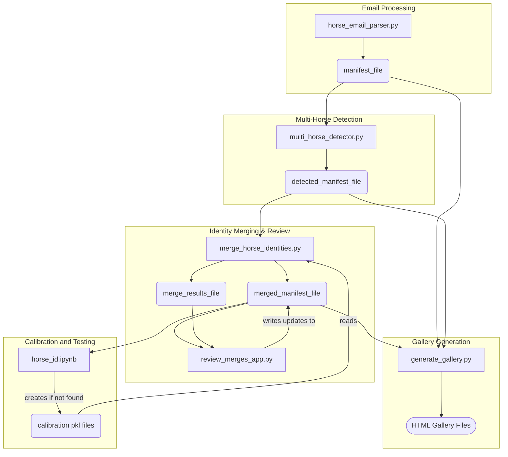

# Horse Identity Matching System

This system is designed to identify an individual horse based on its picture, using a database of labeled horse images that are collected from emails that contain these images as attachments. The system contains components which processes emails containing horse photos, detects horses in those photos, merges photos of the same horse from different emails into a single identity,
and tools to review images and correct merges.

## System Overview

The workflow is divided into several stages, each handled by a specific Python script:

1.  **Email Ingestion (`horse_email_parser.py`)**: Fetches emails from a Gmail account, extracts horse names from subjects, saves image attachments, and creates an initial manifest of photos.
2.  **Multi-Horse Detection (`multi_horse_detector.py`)**: Analyzes each downloaded image to detect the number of horses present (NONE, SINGLE, MULTIPLE) using a YOLOv5 model. It updates the manifest with this detection information.
3.  **Identity Merging (`merge_horse_identities.py`)**: Compares images of horses (identified as 'SINGLE' detection) with the same extracted horse name but from different emails. It uses the WildFusion similarity system to determine if they are the same horse and merges their identities by assigning a common `canonical_id`.
4.  **Merge Review (`review_merges_app.py`)**: A Streamlit web application that allows a user to review the automated merge decisions from `merge_horse_identities.py`, manually merge or un-merge identities, and correct any errors.
5.  **Gallery Generation (`generate_gallery.py`)**: Creates interactive HTML galleries from the various manifest CSV files (base, detected, and merged), allowing for easy visual inspection and filtering of the image data at different stages of processing.

### Key Technologies and Frameworks

*   **WildlifeTools Framework**: The system heavily relies on this suite of tools designed for wildlife image analysis and individual animal identification.
    *   **WildlifeTools Documentation**: https://wildlifedatasets.github.io/wildlife-tools/
    *   **WildlifeDatasets Documentation**: https://wildlifedatasets.github.io/wildlife-datasets/
    *   Key components from WildlifeTools used include:
        *   `ImageDataset` for loading and managing image data.
        *   Feature extractors like `DeepFeatures` (utilizing models like `BVRA/wildlife-mega-L-384` from Hugging Face, also known as `MegaDescriptor-L-384`), `SuperPointExtractor`.
        *   Similarity matchers such as `CosineSimilarity` and `MatchLightGlue`.
        *   The `WildFusion` system for combining multiple similarity scores.
        *   `IsotonicCalibration` for calibrating similarity scores.
*   **YOLOv5**: Used by `multi_horse_detector.py` for multi-object detection, specifically to identify images that contain multiple horses.
*   **Streamlit**: https://streamlit.io/
    * Powers the `review_merges_app.py` for creating an interactive web application for merge review.
*   **Google Gmail API**: Used by `horse_email_parser.py` to fetch and process emails.

## Core Scripts and Functionality

### 1. Email Ingestion (`horse_email_parser.py`)

*   **Authentication**: Securely connects to a specified Gmail account using OAuth 2.0. Credentials and tokens are managed via `credentials.json` and `token.json` (generated on first run).
*   **Email Fetching**: Retrieves new emails that haven't been processed yet by comparing message IDs against the existing manifest.
*   **Information Extraction**:
    *   **Horse Name**: Extracts the horse's name from the email subject line using regular expressions (e.g., "HorseName - Season Year").
    *   **Email Date**: Determines the oldest relevant date associated with the email content, considering forwarded message headers and the email's internal date. This helps in chronological organization.
*   **Attachment Handling**:
    *   Identifies and downloads image attachments (JPG, JPEG, PNG, GIF).
    *   Assigns a unique `canonical_id` to all photos from the *same email*. This ID serves as the initial grouping.
    *   Saves images to a configured `dataset_dir` with a filename format: `{message_id}-{original_filename}`. If duplicate original filenames exist within the same email, a counter is appended (e.g., `{message_id}-{base}-{count}{ext}`).
*   **Manifest Creation**: Creates or updates a CSV file (specified by `manifest_file` in `config.yml`) with one row per downloaded image.

### 2. Multi-Horse Detection (`multi_horse_detector.py`)

*   **Purpose**: Many photos colleded by `horse_email_parser.py` contain images of multiple horses. The goal of `multi-horse_detector.py` is to select the photos are unambiguously images of the labeled horse. These are labeled SINGLE.  Images which are labeled MULTIPLE and NONE are ignored in subsequent processing.
*   **Model Loading**: Loads a pre-trained YOLOv5 model specified in `config.yml`.
*   **Image Analysis**: For each image in the manifest (from the output of `horse_email_parser.py`):
    *   Detects objects and identifies horses (COCO class 17).
    *   **Classification**:
        *   `NONE`: No horses detected.
        *   `SINGLE`: One horse detected, or multiple horses where one is significantly larger than others (based on `SIZE_RATIO` in `config.yml`).
        *   `MULTIPLE`: Multiple horses detected where no single horse is dominant enough to be considered 'SINGLE'.
    *   **Size Ratio**: If multiple horses are detected, it calculates the ratio of the largest horse's bounding box area to the next largest. This is stored as `size_ratio`.
*   **Manifest Update**: Reads the manifest from the previous step, adds/updates `num_horses_detected` and `size_ratio` columns, and saves it to a new CSV file (`detected_manifest_file` in `config.yml`). It can also load and preserve previous detection results if the output file already exists.

### 3. Identity Merging (`merge_horse_identities.py`)

*   **Purpose**: There are multiple emails available for each horse, each with images taken at different times. There are also multiple horses with the same name. The purpose of `merge_horse_identities.py` is to determine whether horses with the same name but different canonical_id are actually the same horse.
*   **Similarity System**: Leverages the **WildlifeTools framework** (specifically WildFusion) to perform sophisticated image similarity comparisons. It employs a combination of deep learning features (e.g., from `BVRA/wildlife-mega-L-384`) and local feature matchers (e.g., SuperPoint with LightGlue). Calibrated models are expected to be present in the `calibration_dir`.
*   **Candidate Selection**:
    *   Filters the manifest for images marked as `SINGLE` horse detections.
    *   Groups these images by the `horse_name` extracted from email subjects.
*   **Pairwise Comparison**:
    *   Within each `horse_name` group, it compares sets of images belonging to different `message_id`s.
    *   The `check_similarity` function uses WildFusion to compute a similarity score between image sets from two different messages. A match is determined if the score exceeds `SIMILARITY_THRESHOLD` from `config.yml`.
*   **Graph-Based Merging**:
    *   Builds a graph where nodes are `canonical_id`s (initially, one per email).
    *   An edge is added between two `canonical_id`s if their respective image sets (from different messages) are deemed similar.
    *   Finds connected components in this graph. All `canonical_id`s within a component are considered to represent the same horse.
    *   The lowest `canonical_id` in a component becomes the new `canonical_id` for all images belonging to that component.
*   **Manifest Update**: Updates the `canonical_id` and `last_merged_timestamp` in the manifest (read from `detected_manifest_file`) and saves it to `merged_manifest_file`.
*   **Merge Log**: Records every pairwise comparison (whether a match or not) along with similarity scores and relevant IDs into `merge_results_file`. This log is crucial for the review app and for caching results to avoid re-computation.

### 4. Merge Review (`review_merges_app.py`)

*   **Purpose**: This tool is used for analyzing and correcting the results of `merge_horse_identities.py`.
*   **Web Interface**: A Streamlit application for interactively reviewing and correcting merge decisions.
*   **Data Loading**: Loads the `merged_manifest_file` (current state of identities) and `merge_results_file` (log of comparisons).
*   **Review Process**:
    *   Iterates through pairs of `message_id`s as recorded in `merge_results_file`.
    *   For each pair, it displays:
        *   Images from both messages.
        *   Their current `canonical_id` and original `canonical_id` (from the manifest).
        *   The similarity score and the system's predicted match status (from `merge_results_file`).
        *   Whether they are currently merged in the manifest.
*   **User Actions**:
    *   **Merge**: If two identities are deemed the same by the user, they can be merged. The app updates the `canonical_id` of all images associated with one identity to match the other (choosing the lower ID as the target). `last_merged_timestamp` is updated.
    *   **Un-merge**: If a previous merge (either by system or user) is incorrect, the identities can be separated. The app reverts the `canonical_id` of the images in the selected messages back to their `original_canonical_id`. `last_merged_timestamp` is cleared.
    *   **Skip**: No change is made.
*   **Manifest Saving**: Any changes made by the user are saved back to the `merged_manifest_file`.

### 5. Gallery Generation (`generate_gallery.py`)

*   **Purpose**: Generate static HTML web galeries for easy review of each of the manifest files.
*   **Multi-Manifest Support**: Reads the base manifest (`manifest_file`), the detected manifest (`detected_manifest_file`), and the final merged manifest (`merged_manifest_file`).
*   **HTML Gallery Creation**: For each manifest, it generates a self-contained static HTML file (e.g., `horse_gallery_base.html`, `horse_gallery_detected.html`, `horse_gallery_merged.html`).
*   **Interactive Features**:
    *   **Navigation**: Allows users to switch between gallery views for the different manifest stages.
    *   **Filtering**: Provides dropdowns and checkboxes to filter images by:
        *   Horse Name
        *   Detection Status (SINGLE, MULTIPLE, NONE)
        *   Merged Status (for the merged gallery, showing horses whose `canonical_id` differs from `original_canonical_id`)
        *   Unmerged (Multiple IDs) Status (showing horses that have multiple `canonical_id`s under the same name)
        *   Size ratio of the bounding box of the largest horse in the image to the next largest horse in the image. 
    *   **Image Modal**: Clicking on an image opens a larger view with detailed metadata (horse name, IDs, detection status, filename, email date, size ratio).
*   **Output**: Saves the generated HTML files to the directory above the `data_root` specified in `config.yml`.

### 6. Calibration and Testing Notebook (`horse_id.ipynb`)
*   **Purpose**: This Jupyter notebook is used for two primary functions:
    1.  **Calibration**: To train and calibrate the individual similarity matchers (e.g., `MatchLightGlue` with `SuperPointExtractor`) used within the `WildFusion` system. This process generates `.pkl` files containing `IsotonicCalibration` models, which are saved to the `calibration_dir`.
    2.  **Testing**: To evaluate the performance of the configured `WildFusion` system on a held-out test set of horse images.
*   **Workflow**:
    *   **Data Loading**:
        *   Loads the `merged_manifest_file` (or another manifest specified for training/testing).
        *   Creates a `WildlifeDataset` (custom `Horses` class) from the manifest, filtering for 'SINGLE' detected horses and excluding any marked as 'EXCLUDE'.
    *   **Data Splitting**: Uses `wildlife_datasets.splits` (e.g., `DisjointSetSplit`, `ClosedSetSplit`) to divide the dataset into training and testing sets, and further splits the test set into query and database sets.
    *   **Matcher Definition**: Defines a dictionary of `SimilarityPipeline`s, each combining a feature extractor (e.g., `SuperPointExtractor`, `DeepFeatures` with `BVRA/wildlife-mega-L-384`) and a matcher (e.g., `MatchLightGlue`, `CosineSimilarity`), along with an `IsotonicCalibration` object.
    *   **Calibration Fitting/Loading**:
        *   Checks for existing `.pkl` calibration files in `CALIBRATION_DIR`.
        *   If files exist, they are loaded.
        *   If not, `wildfusion.fit_calibration()` is called on the training dataset to train the calibrators, which are then saved as `.pkl` files.
    *   **WildFusion System**: Initializes the `WildFusion` system with the (now calibrated) pipelines and a priority pipeline (e.g., `DeepFeatures`).
    *   **Similarity Computation**: Computes a similarity matrix between the query and database image sets using the `WildFusion` system.
    *   **Evaluation**: Uses a `KnnClassifier` (from `wildlife_tools.inference`) to predict identities for the query set based on the similarity matrix and calculates the accuracy of the predictions.
    *   **Visualization**: Includes functionality to display prediction results, showing test images alongside their predicted matches, color-coded for correctness.

## CSV Files and Data Flow

The system uses several CSV files to store and pass data between stages:

1.  **`manifest_file` (e.g., `data/manifest.csv`)**
    *   **Created by**: `horse_email_parser.py`
    *   **Purpose**: Initial list of all downloaded photos and their metadata from emails.
    *   **Key Columns**:
        *   `horse_name`: Extracted from email subject.
        *   `email_date`: Oldest date associated with the email.
        *   `message_id`: Gmail message ID.
        *   `original_filename`: Filename as it was in the email.
        *   `filename`: Filename on disk (e.g., `{message_id}-{original_filename}`).
        *   `date_added`: Date the photo was processed.
        *   `canonical_id`: Initially, a unique ID assigned to all photos from the *same email*.
        *   `original_canonical_id`: Same as `canonical_id` at this stage.
        *   `size_ratio`: (Initialized as NA)
        *   `num_horses_detected`: (Initialized as empty)
        *   `last_merged_timestamp`: (Initialized as NA)
        *   `status`: (Initialized as empty, for potential future use)

2.  **`detected_manifest_file` (e.g., `data/detected_manifest.csv`)**
    *   **Created by**: `multi_horse_detector.py`
    *   **Input**: `manifest_file`
    *   **Purpose**: Adds horse detection results to the manifest.
    *   **Key Columns (in addition to those from `manifest_file`)**:
        *   `num_horses_detected`: "NONE", "SINGLE", or "MULTIPLE".
        *   `size_ratio`: Float value or NA, relevant for "MULTIPLE" detections.

3.  **`merged_manifest_file` (e.g., `data/merged_manifest.csv`)**
    *   **Created/Updated by**: `merge_horse_identities.py` and `review_merges_app.py`
    *   **Input**: `detected_manifest_file` (for `merge_horse_identities.py`), or itself (for `review_merges_app.py`).
    *   **Purpose**: The master manifest reflecting the current state of merged horse identities.
    *   **Key Columns (changes from `detected_manifest_file`)**:
        *   `canonical_id`: Updated to reflect merged identities. Photos of the same horse (even from different emails) will share the same `canonical_id`.
        *   `last_merged_timestamp`: Timestamp of the last merge operation affecting this row.

4.  **`merge_results_file` (e.g., `data/merge_results.csv`)**
    *   **Created/Updated by**: `merge_horse_identities.py` (primarily), read by `review_merges_app.py`.
    *   **Purpose**: Logs all pairwise similarity comparisons made between image sets from different messages. This serves as a cache and an audit trail for the review app.
    *   **Key Columns**:
        *   `timestamp`: When the comparison was made.
        *   `horse_name`: The common horse name under which the comparison was made.
        *   `canonical_id_a`: `canonical_id` of the first group of images at the time of comparison.
        *   `canonical_id_b`: `canonical_id` of the second group of images at the time of comparison.
        *   `message_id_a`: `message_id` for the first group.
        *   `message_id_b`: `message_id` for the second group.
        *   `max_similarity`: The similarity score computed by WildFusion.
        *   `is_match`: Boolean (True/False) indicating if the system predicted them as a match based on the threshold.

**Data Flow Summary:**



## Setup and Configuration

1.  **Clone the repository.**
2.  **Install dependencies**:
    ```bash
    pip install -r requirements.txt
    ```
    (You'll need to create a `requirements.txt` file based on the imports in the Python scripts.)
3.  **Configure Gmail API**:
    *   Follow Google's instructions to enable the Gmail API and download `credentials.json`.
    *   Place `credentials.json` in the root directory or update its path in `config.yml`.
    *   The first time `horse_email_parser.py` runs, it will open a browser window for authentication, creating `token.json`.
4.  **Configure `config.yml`**:
    *   Update `paths` for `data_root`, `dataset_dir`, manifest files, etc., to your desired locations.
    *   Review `gmail` settings.
    *   Review `detection` settings (YOLO model, confidence, size ratio).
    *   Review `similarity` settings (threshold).
    *   Ensure `calibration_dir` points to where your WildFusion calibration files (`.pkl`) are (or will be) stored.
5.  **Download YOLOv5 model weights**: The `multi_horse_detector.py` script will attempt to download them automatically via `torch.hub.load`.

## Running the System

1.  **Ingest Emails**:
    ```bash
    python horse_email_parser.py
    ```
2.  **Detect Horses**:
    ```bash
    python multi_horse_detector.py
    ```
3.  **Merge Identities**:
    ```bash
    python merge_horse_identities.py
    ```
    Note: This step requires calibration files that are created by the `horse_id.ipynb` notebook.
4.  **Review Merges**:
    ```bash
    streamlit run review_merges_app.py
    ```
    Open the URL provided by Streamlit in your web browser.
5. **Generate Galleries**:
    ```bash
    python generate_gallery.py
    open one of the HTML files in your browser: `horse_gallery_base.html`, `horse_gallery_detected.html`, `horse_gallery_merged.html` 
    ```
6. **Calibrate (optional) and Test Performance**:
    Run the `horse_id.ipynb` notebook
