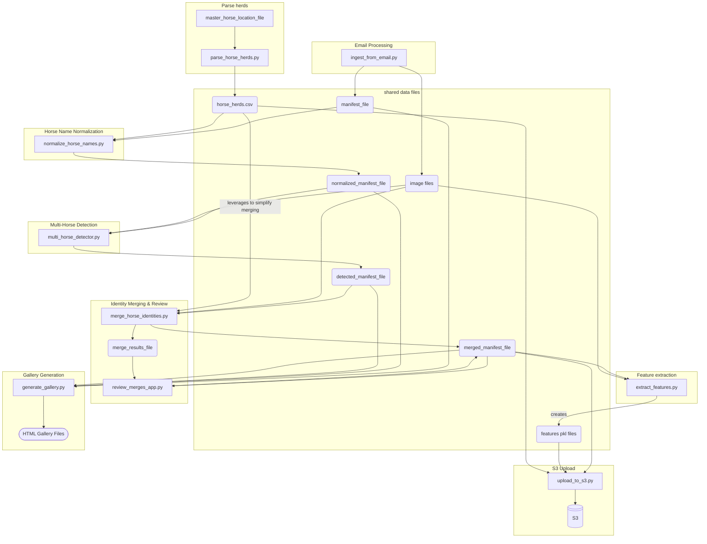

# Horse Identity Matching System

This system is designed to identify an individual horse based on its picture, using a database of labeled horse images that are collected from emails that contain these images as attachments. The system contains components which processes emails containing horse photos, detects horses in those photos, merges photos of the same horse from different emails into a single identity, tools to review images and correct merges, and to extract features.

SMS/MMS (via Twilio SMS Gateway) is the interface used for individual horse identification.  The user sends a MMS message containing a photo of a horse, and they get an SMS response containing the horse's identity.

## System Overview

The workflow is divided into several stages, each handled by a specific Python script:

1.  **Email Ingestion (`ingest_from_email.py`)**: Fetches emails from a Gmail account, extracts horse names from subjects, saves image attachments, and creates an initial manifest of photos.
2.  **Horse Name Normalization (`normalize_horse_names.py`)**: Normalizes horse names from email subjects against a master horse list to address "horse name drift" where email names vary slightly from the official names (e.g., 'Goodwill' vs 'Good Will'). Includes interactive CLI for uncertain matches and saves approved mappings for consistency.
3.  **Multi-Horse Detection (`multi_horse_detector.py`)**: Analyzes each downloaded image to detect the number of horses present (NONE, SINGLE, MULTIPLE) using a YOLOv5 model. It updates the manifest with this detection information.
4.  **Identity Merging (`merge_horse_identities.py`)**: Automatically merges horses with unique names (non-recurring) across different emails while flagging horses with recurring names (e.g., "Cowboy 1", "Cowboy 2") for manual review. No complex similarity analysis is performed.
5.  **Manual Horse Management (`manage_horses.py`)**: A web application for reviewing and manually merging horses with recurring names flagged in step 4, providing tools to reassign canonical IDs and manage horse identities.
6.  **Gallery Generation (`generate_gallery.py`)**: Creates interactive HTML galleries from the various manifest CSV files (base, normalized, detected, and merged), allowing for easy visual inspection and filtering of the image data at different stages of processing.
7. **Calibration and Testing (`horse_id.ipynb`)**: Creates calibration files if none exist, evaluates model performance and creates the prediction results file for side-by-side comparison of test images and model predictions.
8. **Feature Extraction (`extract_features.py`)**: Extracts features using [Wildlife-mega-L-384](https://huggingface.co/BVRA/MegaDescriptor-L-384).
9. **Horse Herds Parsing (`parse_horse_herds.py`)**: Processes the master horse location Excel file to extract horse names and their associated herds, creating a CSV mapping for herd information display.
10. **Upload data (`upload_to_s3.py`)**: Uploads manifest and extracted features to s3.
11. **AWS Lambda Function: (`horse_id.py`)**: Performs similarity comparison between the query image using pre-extracted features.


### Key Technologies and Frameworks

*   **WildlifeTools Framework**: This system heavily relies on the [WildLife Tools](https://wildlifedatasets.github.io/wildlife-tools/) and [WildLife Datasets](https://wildlifedatasets.github.io/wildlife-datasets/) tools designed for individual animal identification. Key components from WildlifeTools used include:
    *   `ImageDataset` for loading and managing image data.
    *   [Wildlife-mega-L-384](https://huggingface.co/BVRA/MegaDescriptor-L-384)
*   **YOLO11**: Used by `multi_horse_detector.py` for multi-object detection, specifically to identify images that contain multiple horses.
*   **Streamlit**: (https://streamlit.io/) Framework used by `review_merges_app.py` to create an interactive web application for merge review.

## 🧪 Testing

This project includes a comprehensive unit test suite and end-to-end tests.  See: [README_TESTING](README_TESTING.md). 

## Core Scripts and Functionality

### 1. Email Ingestion (`ingest_from_email.py`)

*   **Authentication**: Securely connects to a specified Gmail account using OAuth 2.0. Credentials and tokens are managed via `credentials.json` and `token.json` (generated on first run).
*   **Email Fetching**: Retrieves new emails that haven't been processed yet by comparing message IDs against the existing manifest.
*   **Information Extraction**:
    *   **Horse Name**: Extracts the horse's name from the email subject line using regular expressions (e.g., "HorseName - Season Year").
    *   **Email Date**: Determines the oldest relevant date associated with the email content, considering forwarded message headers and the email's internal date. The date is included as part of the image metadata.
*   **Attachment Handling**:
    *   Identifies and downloads image attachments (JPG, JPEG, PNG, GIF).
    *   Assigns a unique `canonical_id` to all photos from the *same email*. 
    *   Saves images to a configured `dataset_dir` with a filename format: `{message_id}-{original_filename}`. If duplicate original filenames exist within the same email, a counter is appended (e.g., `{message_id}-{base}-{count}{ext}`).
*   **Manifest Creation**: Creates or updates a CSV file (specified by `manifest_file` in `config.yml`) with one row per downloaded image.

### 2. Horse Name Normalization (`normalize_horse_names.py`)

*   **Purpose**: Addresses "horse name drift" where email subjects contain slight variations of official horse names (e.g., 'Goodwill' vs 'Good Will', 'DaVinci' vs 'Da Vinci'). Without normalization, horses with name variations would be treated as different horses in downstream processing.
*   **Master Horse List**: Loads the official horse list from `horse_herds_file` (created by `parse_horse_herds.py`) for normalization matching.
*   **Intelligent Matching**: Uses multiple strategies including exact matches, base name matches (handling numbered horses), special case mappings, fuzzy matching, and substring matching.
*   **Interactive CLI**: Prompts users for uncertain matches, showing confidence scores and suggested candidates. Auto-approves high-confidence matches above the configured threshold.
*   **Persistence**: Saves approved name mappings to `approved_horse_normalizations.json` for future consistency and faster processing.
*   **Input/Output**: Reads `manifest_file` and creates `normalized_manifest_file` with additional columns for normalized names, confidence scores, and methods used.

### 3. Multi-Horse Detection (`multi_horse_detector.py`)

*   **Purpose**: Many photos collected by `ingest_from_email.py` contain images of multiple horses. The goal of `multi-horse_detector.py` is to select the photos which are unambiguously images of the labeled horse. These images are labeled SINGLE.  Images which are labeled MULTIPLE and NONE are ignored in subsequent processing.
*   **Model Loading**: Loads a pre-trained YOLOv5 model specified in `config.yml`.
*   **Image Analysis**: For each image in the normalized manifest (from the output of `normalize_horse_names.py`):
    *   Detects objects and identifies horses (COCO class 17).
    *   **Classification**:
        *   `NONE`: No horses detected.
        *   `SINGLE`: One horse detected, or multiple horses where one is significantly larger than others (based on `SIZE_RATIO` in `config.yml`).
        *   `MULTIPLE`: Multiple horses detected where no single horse is dominant enough to be considered 'SINGLE'.
    *   **Size Ratio**: If multiple horses are detected, it calculates the ratio of the largest horse's bounding box area to the next largest. This is stored as `size_ratio`.
*   **Manifest Update**: Reads the normalized manifest from the previous step, adds/updates `num_horses_detected` and `size_ratio` columns, and saves it to a new CSV file (`detected_manifest_file` in `config.yml`). The system preserves previous detection results if the output file already exists.

### 4. Identity Merging (`merge_horse_identities.py`)

*   **Purpose**: There are multiple emails available for each horse, each with images taken at different times. There are also multiple horses with the same name. The purpose of `merge_horse_identities.py` is to safely merge horses with unique names while flagging ambiguous cases for manual review.
*   **Two-Tiered Approach**: The system uses different strategies based on horse name patterns identified from `parse_horse_herds.py`:
    *   **Non-Recurring Names**: Horses with unique names (e.g., "Thunder", "Lightning") are automatically merged across all emails since there's only one horse with that name.
    *   **Recurring Names**: Horses with numbered names (e.g., "Cowboy 1", "Cowboy 2") are flagged for manual review since multiple horses may share similar base names.
*   **Processing Flow**:
    *   Filters the manifest for images marked as `SINGLE` horse detections.
    *   Groups these images by the `normalized_horse_name` from the normalization step.
    *   **Auto-merges non-recurring names**: All images with the same unique normalized name get merged into a single `canonical_id`.
    *   **Flags recurring names for manual review**: When multiple `canonical_id`s exist for recurring horse names, outputs detailed information for manual review using `manage_horses.py`.
*   **Manual Review Output**: For recurring names with multiple canonical IDs, the script provides:
    *   Clear warnings with horse names requiring attention
    *   Specific canonical IDs that need review
    *   Image counts and email sources for each canonical ID
    *   Instructions to use `manage_horses.py` for manual merging
*   **Manifest Update**: Updates the `canonical_id` and `last_merged_timestamp` only for auto-merged non-recurring names. Recurring names retain their original canonical IDs for manual review.

### 5. Horse Management (`manage_horses.py`)

*   **Purpose**: Primary tool for manually reviewing and managing horse identities, especially for recurring names flagged by `merge_horse_identities.py`.
*   **Web Interface**: A Streamlit application providing comprehensive horse identity management capabilities.
*   **Data Loading**: Loads the `merged_manifest_file` and displays horses grouped by `canonical_id`.
*   **Key Features**:
    *   **Horse Selection**: Browse all horses by canonical ID with status indicators and image counts.
    *   **Image Gallery**: View all images for a selected horse with filtering options (single horse detections only).
    *   **Status Management**: Update status flags (Active, EXCLUDE, REVIEW) for individual images or entire horses.
    *   **Canonical ID Assignment**: Merge horses by reassigning images to different canonical IDs or creating new ones.
    *   **Horse Name Management**: Update normalized horse names for consistency.
*   **Manual Merge Workflow**: When `merge_horse_identities.py` flags recurring names:
    1. Select the first canonical ID for the recurring horse name
    2. Review images to confirm it represents the target horse
    3. Use "Canonical ID Assignment" tab to find other canonical IDs for the same horse name
    4. Reassign images from duplicate canonical IDs to the primary one
    5. Repeat for all flagged recurring names
*   **Data Integrity**: Enforces the critical rule that all images with the same `canonical_id` must have the same `normalized_horse_name`.

### 6. Gallery Generation (`generate_gallery.py`)

*   **Purpose**: Generate static HTML web galeries for easy review of each of the manifest files.
*   **Multi-Manifest Support**: Reads the base manifest (`manifest_file`), the normalized manifest (`normalized_manifest_file`), the detected manifest (`detected_manifest_file`), and the final merged manifest (`merged_manifest_file`).
*   **HTML Gallery Creation**: For each manifest, it generates a self-contained static HTML file (e.g., `horse_gallery_base.html`, `horse_gallery_normalized.html`, `horse_gallery_detected.html`, `horse_gallery_merged.html`).
*   **Interactive Features**:
    *   **Navigation**: Allows users to switch between gallery views for the different manifest stages.
    *   **Filtering**: Provides dropdowns and checkboxes to filter images by:
        *   Horse Name
        *   Detection Status (SINGLE, MULTIPLE, NONE)
        *   Merged Status (for the merged gallery, showing horses whose `canonical_id` differs from `original_canonical_id`)
        *   Unmerged (Multiple IDs) Status (showing horses that have multiple `canonical_id`s under the same name)
        *   Size ratio of the bounding box of the largest horse in the image to the next largest horse in the image. 
    *   **Image Modal**: Clicking on an image opens a larger view with detailed metadata (horse name, IDs, detection status, filename, email date, size ratio).
*   **Output**: Saves the generated HTML files to `data_root` directory, specified in `config.yml`.

### 7. Calibration and Testing Notebook (`horse_id.ipynb`)
*   **Purpose**: This Jupyter notebook is used for two primary functions:
    1.  **Calibration**: To train and calibrate the individual similarity matchers (e.g., `MatchLightGlue` with `SuperPointExtractor`) used within the `WildFusion` system. This process generates `.pkl` files containing `IsotonicCalibration` models, which are saved to the `calibration_dir`.
    2.  **Testing**: To evaluate the performance of the configured `WildFusion` system on test set of horse images that is exclusive from the images used for calibration.
*   **Workflow**:
    *   **Data Loading**:
        *   Loads the `merged_manifest_file`. 
        *   Creates a `WildlifeDataset` (custom `Horses` class) from the manifest, filtering for 'SINGLE' detected horses.
    *   **Data Splitting**: Uses `wildlife_datasets.splits` to divide the dataset into calibration and testing sets, and further splits the testng set into query and database sets.
    *   **Calibration Fitting/Loading**:
        *   Checks for existing `.pkl` calibration files in `CALIBRATION_DIR`.
        *   If files exist, they are loaded.
        *   If not, `wildfusion.fit_calibration()` is called on the training dataset to train the calibrators, which are then saved as `.pkl` files.
    *   **WildFusion System**: Initializes the `WildFusion` system with the (now calibrated) pipelines and a priority pipeline (e.g., `DeepFeatures`).
    *   **Similarity Computation**: Computes a similarity matrix between the query and database image sets using the `WildFusion` system.
    *   **Evaluation**: Uses a `KnnClassifier` to predict identities for the query set based on the similarity matrix and calculates the accuracy of the predictions.
    *   **Visualization**: Creates an HTML display of prediction results, showing test images alongside their predicted matches with similarity scores, color-coded based on whether the match was correct.

### 8. Feature Extraction (`extract_features.py`)
*   **Purpose**: To speed up similarity processing at runtime, pre-extract features from all database images.
*   **Workflow**: Extracts features using [Wildlife-mega-L-384](https://huggingface.co/BVRA/MegaDescriptor-L-384).

### 9. Horse Herds Parsing (`parse_horse_herds.py`)
*   **Purpose**: Processes the master horse location Excel file to create a structured CSV mapping of horse names to their respective herds. This enables the identification system to provide herd information alongside horse identities.
*   **Configuration Integration**: Uses paths from `config.yml` for both input (`master_horse_location_file`) and output (`horse_herds_file`) files, maintaining consistency with the rest of the system.
*   **Excel Processing**:
    *   Reads the master horse location Excel file with a specific structure where row 3 contains herd names and counts.
    *   Parses herd information starting from row 5, extracting horse names for each herd column.
    *   Handles horses appearing in multiple herds by creating separate entries for each horse-herd combination.
*   **Data Analysis and Validation**:
    *   Identifies horses with shared names across different herds.
    *   Detects horses with numbered naming patterns (e.g., "George 2", "Sunny 1").
    *   Provides detailed statistics on herd distribution and horse counts.
    *   Removes duplicates while preserving all valid horse-herd relationships.
*   **Output**: Creates a CSV file (`horse_herds.csv`) with columns `horse_name` and `herd`, which is later used by the identification system to display herd information in results (e.g., "Thunder - West Herd" or "Ranger - Herds Alpha Herd, Mountain Herd").
*   **Usage**: Can be run with configuration file paths or with custom input/output file arguments for flexibility.

### 10. Upload Data (`upload_to_s3.py`)
*   **Purpose**: Provide data required by `horse_id.py`
*   **Workflow**: Uploads to s3 the pre-extracted features and the merged manifest to/from the locations defined in `config.yml`.

### 11. AWS Lambda Function: (`horse_id.py`)
*   **Purpose**: This script serves as the AWS Lambda function responsible for real-time horse identification from an image URL. It is designed to receive Twilio webhook requests, fetch image, perform similarity comparisons, and return results.
*   **Asynchronous Architecture**: The system uses two Lambda functions created from two different docker images. This design ensures a quick response to Twilio webhooks while allowing the computationally intensive image processing to run in the background.
    1.  **`webhook-responder` (Handler: `webhook_responder.webhook_handler`)**:
        *   **Purpose**: This is the public-facing Lambda function that directly receives the Twilio MMS webhook. Its primary goal is to respond immediately to Twilio to prevent timeouts.
        *   **Process**:
            *   Parses the incoming Twilio webhook event.
            *   Asynchronously invokes the `horse-id-processor` Lambda function, passing the original event payload.
            *   Returns a 200 OK TwiML response to Twilio with a confirmation message (e.g., "Identification started!").
        *   **Configuration**: Requires the `PROCESSOR_LAMBDA_NAME` environment variable to be set to the full ARN or name of the `horse-id-processor` function.
        *   **Files**: 
            - `webhook-responder.py`
            - `Dockerfile.responder` 
            - `responder-requirements.txt`
    2.  **`horse-id-processor` (Handler: `horse_id.horse_id_processor_handler`)**:
        *   **Purpose**: This Lambda function performs the actual horse identification. It is invoked asynchronously by the `wilio-webhook-responder`.
        *   **Process**:
            *   Loads system configuration from `config.yml`.
            *   Downloads necessary data artifacts (`merged_manifest.csv`, `database_deep_features.pkl`) from an Amazon S3 bucket.
            *   Fetches the horse image from the `MediaUrl0` provided in the event.
            *   Extracts deep features from the image using `wildlife-mega-L-384`.
            *   Compares the extracted features against the database of horse features.
            *   Identifies the top matching horse identities and applies a confidence threshold.
            *   Uses the Twilio REST API to send the identification results (or an error message) directly back to the user as an SMS.
        *   **Configuration**: Requires `TWILIO_ACCOUNT_SID` and `TWILIO_AUTH_TOKEN` environment variables for sending SMS via the Twilio API. It should also have a sufficiently long timeout (e.g., 1-2 minutes) to complete the processing.
        *   **Files**: 
            - `horse_id.py`
            - `Dockerfile.horse_id` 
            - `horse-id-requirements.txt`


## User Interaction Flow

1. User sends a photo of a horse to the system via MMS
2. The SMS Gateway calls the ML Pipeline via webhook
3. The ML Pipeline fetches the photo from the SMS Gateway
4. The ML Pipeline identifies the identity of the horse in the photo
5. The ML Pipeline returns the name of the horse and related metadata to the SMS Gateway
6. The SMS Gateway returns the name of the horse and related metadata to the user via SMS.


## CSV Files and Data Flow

The system uses several CSV files to store and pass data between stages:

1.  **`manifest_file` (e.g., `data/manifest.csv`)**
    *   **Created by**: `ingest_from_email.py`
    *   **Purpose**: Initial list of all downloaded photos and their metadata from emails.
    *   **Key Columns**:
        *   `horse_name`: Extracted from email subject.
        *   `email_date`: Oldest date associated with the email.
        *   `message_id`: Gmail message ID.
        *   `original_filename`: Filename as it was in the email.
        *   `filename`: Filename on disk (e.g., `{message_id}-{original_filename}`).
        *   `date_added`: Date the photo was processed.
        *   `canonical_id`: Initially, a unique ID assigned to all photos from the *same email*.
        *   `original_canonical_id`: Same as `canonical_id` at this stage.
        *   `size_ratio`: (Initialized as NA)
        *   `num_horses_detected`: (Initialized as empty)
        *   `last_merged_timestamp`: (Initialized as NA)
        *   `status`: (Initialized as empty, for potential future use)

2.  **`normalized_manifest_file` (e.g., `data/normalized_manifest.csv`)**
    *   **Created by**: `normalize_horse_names.py`
    *   **Input**: `manifest_file`
    *   **Purpose**: Adds normalized horse names to address name variations from email subjects.
    *   **Key Columns (in addition to those from `manifest_file`)**:
        *   `normalized_horse_name`: Standardized horse name matching the master list.
        *   `normalization_confidence`: Confidence score of the normalization (0.0-1.0).
        *   `normalization_method`: Method used (exact, auto_*, user_approved, previously_approved).
        *   `normalization_timestamp`: When the normalization was performed.

3.  **`detected_manifest_file` (e.g., `data/detected_manifest.csv`)**
    *   **Created by**: `multi_horse_detector.py`
    *   **Input**: `normalized_manifest_file`
    *   **Purpose**: Adds horse detection results to the manifest.
    *   **Key Columns (in addition to those from `normalized_manifest_file`)**:
        *   `num_horses_detected`: "NONE", "SINGLE", or "MULTIPLE".
        *   `size_ratio`: Float value or NA, relevant for "MULTIPLE" detections.

4.  **`merged_manifest_file` (e.g., `data/merged_manifest.csv`)**
    *   **Created/Updated by**: `merge_horse_identities.py` and `review_merges_app.py`
    *   **Input**: `detected_manifest_file` (for `merge_horse_identities.py`), or itself (for `review_merges_app.py`).
    *   **Purpose**: The master manifest reflecting the current state of merged horse identities.
    *   **Key Columns (changes from `detected_manifest_file`)**:
        *   `canonical_id`: Updated to reflect merged identities. Photos of the same horse (even from different emails) will share the same `canonical_id`.
        *   `last_merged_timestamp`: Timestamp of the last merge operation affecting this row.

5.  **`horse_herds_file` (e.g., `data/horse_herds.csv`)**
    *   **Created by**: `parse_horse_herds.py`
    *   **Input**: `master_horse_location_file` (Excel file specified in config.yml)
    *   **Purpose**: Maps horse names to their respective herds to enable herd information display in identification results.
    *   **Key Columns**:
        *   `horse_name`: Name of the horse.
        *   `herd`: Name of the herd the horse belongs to.
    *   **Usage**: Used by `horse_id.py` to format identification results with herd information (e.g., "Thunder - West Herd" or "Ranger - Herds Alpha Herd, Mountain Herd").
    *   **Multi-Herd Support**: Horses appearing in multiple herds have separate entries for each herd, allowing the system to display all associated herds.

**Data Flow Summary:**



## Multi-User Safety and Locking

The system includes a distributed locking mechanism to prevent conflicts when multiple users are working with the same shared data directory (e.g., Google Drive):

### Pipeline Lock System

- **Automatic Locking**: The unified pipeline (`run_pipeline.sh`/`run_pipeline.bat`) automatically creates a lock when running
- **Cross-Machine Detection**: Locks work across different computers sharing the same data directory
- **Interactive Override**: Users can see who has locks and choose to override them with clear warnings
- **Lock Information**: Displays lock age, user, hostname, and current pipeline stage
- **Automatic Cleanup**: Locks are automatically cleaned up on completion, failure, or interruption

### Lock Management

**Check lock status:**
```bash
./run_pipeline.sh --check-lock        # macOS/Linux
run_pipeline.bat --check-lock         # Windows
python pipeline_lock.py --check       # Direct Python
```

**Force remove stale locks:**
```bash
python pipeline_lock.py --remove      # Interactive removal with prompts
python pipeline_lock.py --force-remove # Force removal without prompts
```

### Using manage_horses.py with Locks

The `manage_horses.py` tool respects pipeline locks:
- **Blocked access**: Shows detailed lock information when a pipeline is running
- **Override option**: Allows experienced users to override locks with warnings
- **Safe browsing**: Users can view data even when overriding locks

### Horse Management Application

The horse management application provides a comprehensive web interface for reviewing and managing horse identities:

**Easy Startup:**
```bash
# macOS/Linux (recommended)
./manage_horses.sh

# Windows (recommended)  
manage_horses.bat

# Alternative - direct Streamlit
streamlit run manage_horses.py
```

**Key Features:**
- **Visual Image Gallery**: Browse all images for each horse with filtering options
- **Status Management**: Mark images as Active, EXCLUDE, or REVIEW
- **Canonical ID Merging**: Reassign images between horses or create new identities
- **Horse Name Management**: Update normalized horse names for consistency
- **Detection Override**: Manually correct automatic horse detection results
- **Multi-User Safety**: Respects pipeline locks with override capability
- **Data Integrity**: Enforces consistent horse naming within canonical IDs

**Workflow for Manual Review:**
1. Pipeline flags recurring horse names (e.g., "Cowboy 1", "Cowboy 2")
2. Open management app and select flagged horses
3. Review images to identify which represent the same animal
4. Use "Canonical ID Assignment" tab to merge duplicate identities
5. Verify results and continue with remaining flagged horses

### Best Practices

1. **Use the unified pipeline** (`run_pipeline.sh`) rather than individual scripts
2. **Check for locks** before starting work if you suspect conflicts
3. **Override conservatively** - only when certain the pipeline isn't running elsewhere
4. **Communicate** with team members about long-running operations

## Setup and Configuration

1.  **Clone the repository.**
2.  **Install dependencies**:
    ```bash
    pip install -r requirements.txt
    ```
3.  **Configure Gmail API**:
    *   Follow Google's instructions to enable the Gmail API and download `credentials.json`.
    *   Place `credentials.json` in the root directory or update its path in `config.yml`.
    *   The first time `ingest_from_email.py` runs, it will open a browser window for authentication, creating `token.json`.
4.  **Configure the system**:
    
    The system uses a flexible configuration approach supporting environment variables and local overrides:

    **Basic Setup (Recommended)**:
    - Copy `config.local.yml.example` to `config.local.yml`
    - Edit `config.local.yml` to set your local data path:
      ```yaml
      paths:
        data_root: "/path/to/your/horse-data"  # Absolute path to your data directory
      ```
    - The `config.local.yml` file is automatically ignored by git, preventing conflicts when working with others
    
    **Alternative: Environment Variable**:
    ```bash
    export HORSE_ID_DATA_ROOT="/path/to/your/horse-data"
    ```
    
    **Configuration Priority** (highest to lowest):
    1. Environment variables (e.g., `HORSE_ID_DATA_ROOT`)
    2. Local config file (`config.local.yml`)
    3. Base config file (`config.yml`)
    
    **Other Settings**:
    *   Review `gmail` settings in `config.yml` or override in `config.local.yml`.
    *   Review `detection` settings (YOLO model, confidence, size ratio).
    *   Review `similarity` settings (threshold).
    *   Ensure `calibration_dir` points to where your WildFusion calibration files (`.pkl`) are (or will be) stored.

5.  **Configure AWS CLI**
    *   Authenticate using `aws configure sso`
    *   Set `AWS_PROFILE` environment variable accordingly

## Running the System

### 🚀 Recommended: Unified Pipeline (New)

The preferred way to run the system is using the unified pipeline script that combines all processing steps into a single atomic operation with multi-user safety:

**macOS/Linux:**
```bash
# Interactive directory ingestion (default)
./run_pipeline.sh

# Email ingestion
./run_pipeline.sh --email

# Non-interactive directory ingestion
./run_pipeline.sh --dir --path /path/to/horses --date 20240315

# Force override existing locks
./run_pipeline.sh --force

# Check lock status
./run_pipeline.sh --check-lock
```

**Windows:**
```batch
# Interactive directory ingestion (default)
run_pipeline.bat

# Email ingestion
run_pipeline.bat --email

# Non-interactive directory ingestion
run_pipeline.bat --dir --path C:\path\to\horses --date 20240315

# Force override existing locks
run_pipeline.bat --force
```

**Benefits of the unified pipeline:**
- **Single command** replaces 4 separate script runs
- **Multi-user safety** with distributed locking prevents conflicts
- **Automatic cleanup** on completion or failure
- **Progress tracking** with stage-by-stage updates
- **Cross-platform** support for macOS, Linux, and Windows

**Manual Review (if needed):**

**macOS/Linux:**
```bash
./manage_horses.sh
```

**Windows:**
```batch
manage_horses.bat
```

**Alternative (any platform):**
```bash
streamlit run manage_horses.py
```

Use this tool to manually review and merge recurring horse names flagged by the pipeline. The pipeline will provide specific guidance on which horses need review. The wrapper scripts automatically handle virtual environment activation and provide better error messages.

### 🔧 Alternative: Individual Scripts (Advanced/Debugging)

For debugging or advanced use cases, you can still run individual scripts:

1.  **Ingest Emails**:
    ```bash
    python ingest_from_email.py
    ```
2.  **Normalize Horse Names**:
    ```bash
    python normalize_horse_names.py
    ```
    This step addresses "horse name drift" and is required before detection. It may prompt you interactively for uncertain name matches.
3.  **Detect Horses**:
    ```bash
    python multi_horse_detector.py
    ```
4.  **Merge Identities**:
    ```bash
    python merge_horse_identities.py
    ```
    This will automatically merge non-recurring horse names and flag recurring names for manual review.
5.  **Manual Review (if needed)**:
    ```bash
    # macOS/Linux
    ./manage_horses.sh
    
    # Windows  
    manage_horses.bat
    
    # Alternative (any platform)
    streamlit run manage_horses.py
    ```
    Use this tool to manually review and merge recurring horse names flagged in step 4. Open the URL provided by Streamlit in your web browser.
6. **Generate Galleries**:
    ```bash
    python generate_gallery.py
    open one of the HTML files in your browser: `horse_gallery_base.html`, `horse_gallery_normalized.html`, `horse_gallery_detected.html`, `horse_gallery_merged.html` 
    ```
7. **Calibrate (optional) and Test Performance**:

    Run the `horse_id.ipynb` notebook

8. **Parse Horse Herds**:
    ```bash
    python parse_horse_herds.py
    ```
    This creates the horse-to-herd mapping CSV file used for displaying herd information in identification results and is required before horse name normalization.

9. **Extract Features**:
    ```bash
    python extract_features.py
    ```

10. **Upload data to S3**:

    Authenticate to AWS, then
    ```bash
    python upload_to_s3.py
    ```


## Deployment

1. **Create image and push image to registry**:
2. **Create two Lambda Functions from the image**
    1. webhook-responder 
        - Set environment variable `PROCESSOR_LAMBDA_NAME` to the full ARN or name of the `horse-id-processor` function
        - Set environment variables `TWILIO_AUTH_TOKEN` with your Twilio credentials. This is used for Twilio request validation.
    2. horse-id-processor
        - Set environment variables `TWILIO_ACCOUNT_SID` and `TWILIO_AUTH_TOKEN` with your Twilio credentials.
        - Increase the timeout (e.g., to 1-2 minutes) to allow for model loading and processing.
        - Increase memory to 2048 MB
