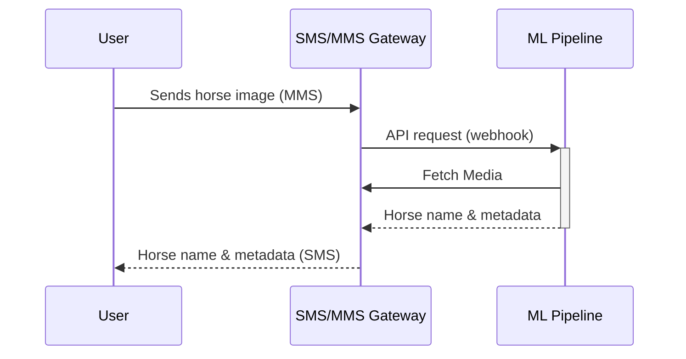

# Messaging Architecture and Consent

This document is intended to describe how the Horse ID messaging opt-in process works.  

The Horse ID project uses an SMS/MMS interface to enable users to easily interact with the system via mobile devices in areas without reliable internet data coverage. In order to comply with US federal regulations governing application-to-person (ATP) usage of SMS/MMS, it is important to document how this system acquires proof of consent from users who will receive messages from the system.

This is a **transactional** system in which the application sends one message in response to each incoming message from users.  Exactly one response is sent for each incoming message. **Under no circumstances will the system send messages other than in response to an incoming message.**

**By sending an MMS message to the system, the user consents to receive a response.** Unless the user sends an MMS message to the system, they will receive no responses.  If, after receiving a response from the system, the user sends no future messages, they will receive no future responses.

The transactional flow is as follows:
1. User sends a photo of a horse to the system via MMS
2. The SMS Gateway calls the ML Pipeline via webhook
3. The ML Pipeline fetches the photo from the SMS Gateway
4. The ML Pipeline identifies the identity of the horse in the photo
5. The ML Pipeline returns the name of the horse and related metadata to the SMS Gateway
6. The SMS Gateway returns the name of the horse and related metadata to the user via SMS.

